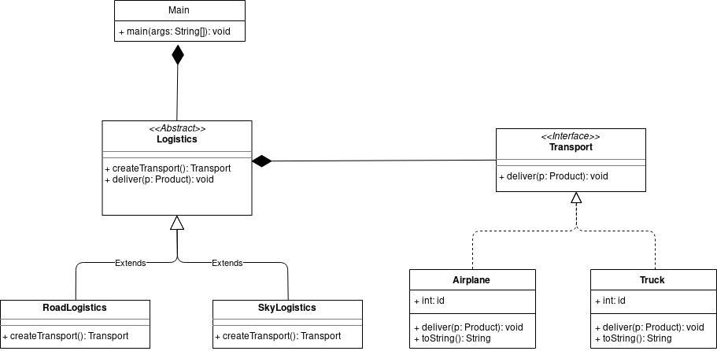

# Factory Method  

**Creational pattern**

More information about this pattern: [https://refactoring.guru/design-patterns/factory-method](https://refactoring.guru/design-patterns/factory-method)  

# Exercise  

Implement the factory method design pattern to create different means of transport to deliver different products.  

## Classes developed  

* **Main.java** - Client application
* **Transport.java** - Interface of concrete means of transport
* **Airplane.java** - Concrete airplane class
* **Transport.java** - Concrete truck class
* **Logistics.java** - Abstract class to create concrete means of transport
* **SkyLogistics.java** - Concrete airplane creator
* **RoadLogistics.java** - Concrete truck creator
* **Product.java** - Product to deliver class  

## UML Diagram  

  

## How to run  

* On factory-method directory, open a terminal and type:  
```console
$ javac *.java -d bin
$ cd bin
$ java Main
```  

## Authors  

* **Tiago Mendes**: [tiagocmendes](https://github.com/tiagocmendes)  

**Last updated:** *May 24, 2019*
